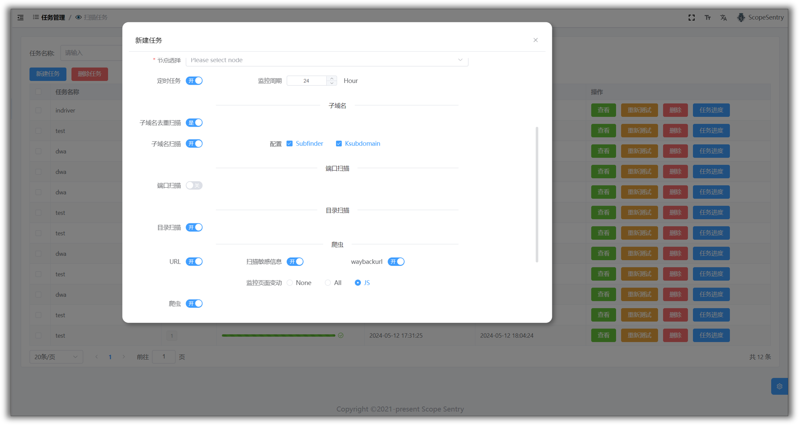
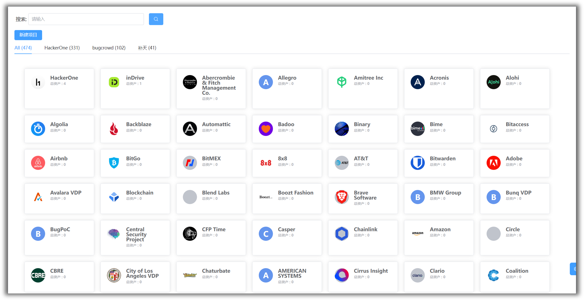

	

# 网址

- 官网：[https://www.scope-sentry.top](https://www.scope-sentry.top)
- Github: [https://github.com/Autumn-27/ScopeSentry](https://github.com/Autumn-27/ScopeSentry)

# 介绍
Scope Sentry是一款具有资产测绘、子域名枚举、信息泄露检测、漏洞扫描、目录扫描、子域名接管、爬虫、页面监控功能的工具，通过构建多个节点，自由选择节点运行扫描任务。当出现新漏洞时可以快速排查关注资产是否存在相关组件。

# 目前功能
- 子域名枚举
- 子域名接管检测
- 端口扫描
- 资产识别
- 目录扫描
- 漏洞扫描
- 敏感信息泄露检测
- URL提取
- 爬虫
- 页面监控
- 自定义WEB指纹
- POC导入
- 资产分组
- 多节点扫描
- webhook

# To DO
- 插件系统
- 弱口令爆破
- 数据清洗
- 数据共享？
- ~

# 截图

## 登录

## 首页面板

## 资产数据

## 项目

## 任务

## 任务进度

## 节点

